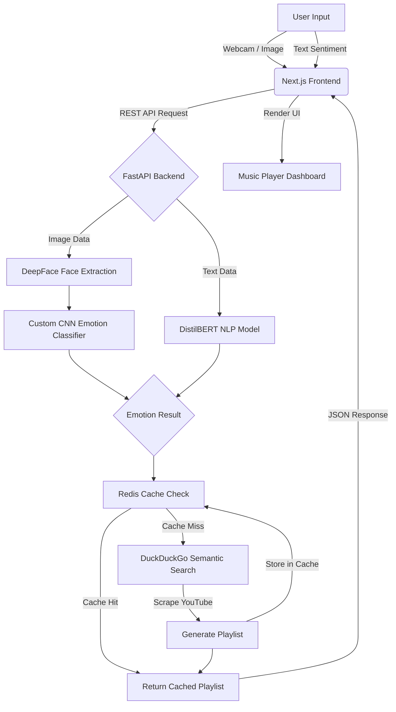

<div align="center">
  <h1>🎵 MoodTunes: AI-Powered Emotion Detection & Music Recommender</h1>
  <p><em>An intelligent full-stack application that reads human emotions through facial expressions and text sentiment to curate real-time personalized music playlists.</em></p>
  
  [](https://python.org)
  [](https://fastapi.tiangolo.com/)
  [](https://nextjs.org/)
  [](https://tensorflow.org)
  [](https://redis.io)
</div>

---

## 📌 Executive Summary

**MoodTunes** bridges the gap between human emotion and digital entertainment. By utilizing a **Hybrid AI Pipeline**, it captures real-time facial expressions or written text, accurately classifies the underlying emotion, and seamlessly interfaces with YouTube to deliver instant, mood-aligned music recommendations.

This project demonstrates strong proficiency in **Full-Stack Development**, **Machine Learning Integration**, and **System Architecture**—showcasing the ability to build scalable, AI-driven web applications from end-to-end.

---

## ✨ Key Features & Business Value

- **🎭 Hybrid Visual AI Pipeline:** Combines the structural precision of `DeepFace` with a proprietary, custom-trained Convolutional Neural Network (CNN) for highly accurate facial emotion classification.
- **🧠 NLP Sentiment Engine:** Utilizes HuggingFace Transformer models (`DistilBERT`) to extract deep emotional context from textual user inputs.
- **🌍 Global Music Intelligence:** Dynamically maps classified emotions to curated YouTube search queries, supporting regional and localized music genres (e.g., K-Pop, Bengali, Hindi, Punjabi).
- **⚡ High-Performance Caching:** Implements `Redis` to cache frequent queries, slashing external API calls and ensuring sub-second response times.
- **📱 Progressive Web App (PWA):** Features a sleek, responsive Next.js frontend built with Tailwind CSS, offering an installable, app-like experience across mobile and desktop devices.

---

## 🛠️ Technology Stack

### **Frontend (Client-Side)**
- **Framework:** Next.js 15 (React)
- **Styling:** Tailwind CSS v4
- **Language:** TypeScript
- **Architecture:** Progressive Web App (PWA) ready

### **Backend (Server-Side)**
- **Framework:** FastAPI (Asynchronous Python)
- **Caching & DB:** Redis
- **Integration:** DuckDuckGo Semantic Search (`ddgs`) for robust YouTube scraping

### **Artificial Intelligence & Machine Learning**
- **Computer Vision:** TensorFlow / Keras (Custom CNN), OpenCV, DeepFace
- **Natural Language Processing:** HuggingFace Transformers (`pt` framework)
- **Data Processing:** NumPy, Pandas

---

## 🏗️ System Architecture



---

## 🚀 Getting Started (Local Development)

The application consists of two microservices: the **Python Backend** and the **Next.js Frontend**.

### 1. Backend Setup (FastAPI & AI Models)
```bash
# Clone the repository and navigate to the project root
git clone https://github.com/yourusername/Emotion-Detection-and-Music-Recommendation-System.git
cd Emotion-Detection-and-Music-Recommendation-System

# Create and activate a Python virtual environment
python -m venv venv
source venv/bin/activate  # On Windows use: venv\Scripts\activate

# Install dependencies
pip install -r requirements.txt

# Start the FastAPI server
cd backend
python -m uvicorn app:app --reload --host 0.0.0.0 --port 8000
```
*API Documentation available at: `http://localhost:8000/docs`*

### 2. Frontend Setup (Next.js)
Open a **new terminal window**:
```bash
# Navigate to the frontend directory
cd frontend

# Install Node.js dependencies
npm install

# Start the development server
npm run dev
```
*Access the application at: `http://localhost:3000`*

---

## ⚠️ Technical Notes & Compatibility

- **Redis Requirement:** For the caching mechanism to work, a local instance of Redis must be running on port `6379`. If Redis is not found, the app gracefully degrades and bypasses caching without crashing.
- **TensorFlow Versions:** The default custom CNN model (`emotion_model.h5`) was trained on TensorFlow 2.x. If running in a TF/Keras 3.x environment, the backend handles serialization fallbacks to ensure API stability.
- **GPU Acceleration:** The system automatically utilizes CUDA if NVIDIA drivers are present, otherwise, it optimizes for CPU inference using AVX2 instructions.

---

## 💡 Future Roadmap

- [ ] **Spotify/Apple Music OAuth Integration:** Allow users to instantly save generated playlists directly to their personal streaming accounts.
- [ ] **Continuous Learning:** Implement a feedback loop where users can rate playlist accuracy to retrain and fine-tune the emotion-mapping algorithm.
- [ ] **Dockerization:** Complete `docker-compose` orchestration for seamless, one-click deployments.

---

<div align="center">
  <i>Developed with ❤️ for building intelligent, user-centric AI applications.</i>
</div>